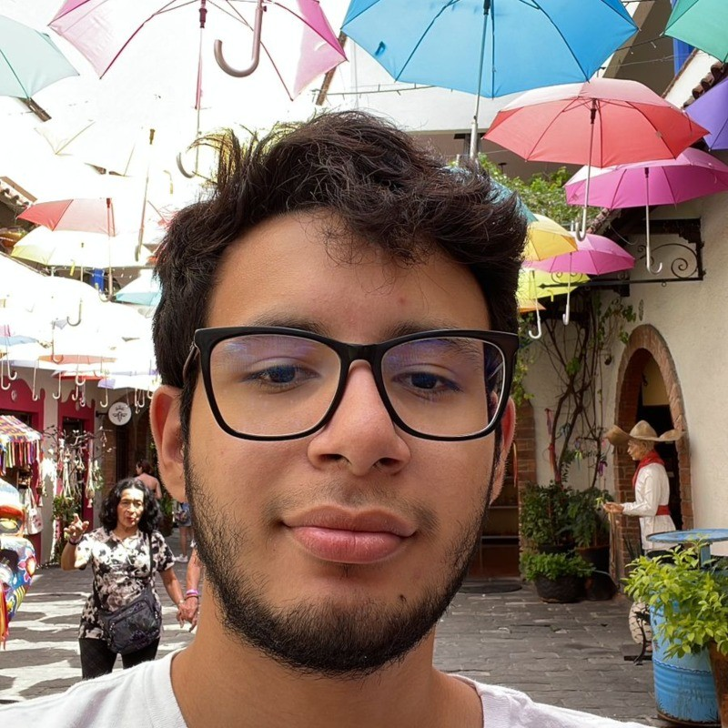
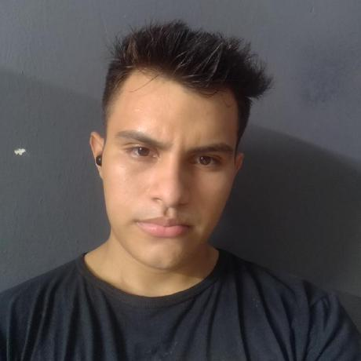

# IHC-2026

Este proyecto es desarrollado como parte del curso de Interacción Humano Computadora del sexto semestre de la Facultad de Matemáticas.

| Nombre del Integrante               | Foto                                                                                                                    |
| ----------------------------------- | ----------------------------------------------------------------------------------------------------------------------- |
| Esteban Canto Vázquez |    |
| Eduardo José Matos Uc |    |
| Ángel Leandro Puch Uribe            |        |
| Mauricio Emiliano Ramírez Ceciliano |  |
| Jorge Gabriel Vargues Suárez  |  |